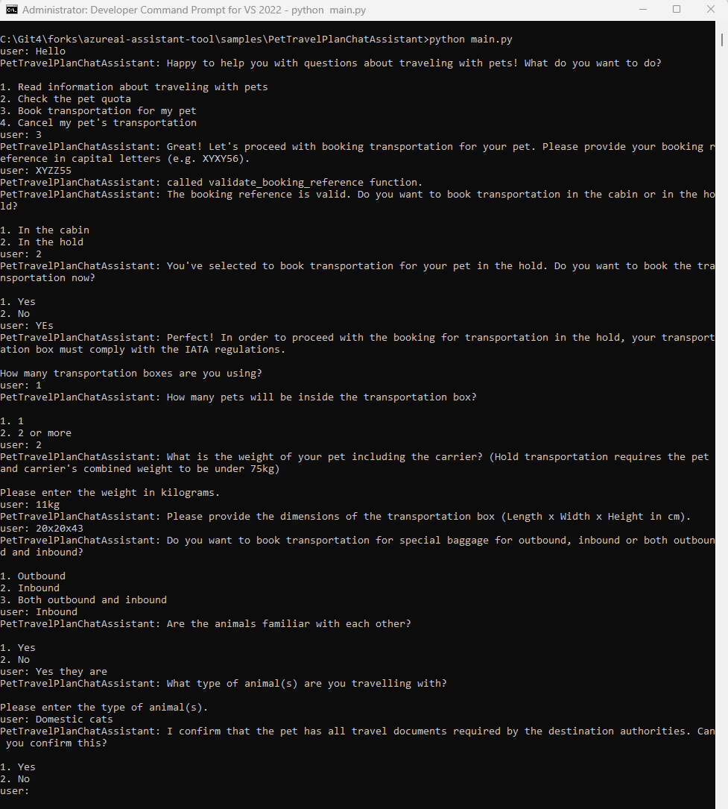

# Sample: Plan pets travel using yaml form and ChatAssistantClient

This sample demonstrates how to leverage a YAML form (alternatively, the form could be in some other text format) to create a intelligent chatbot experience tailored for pet travel planning. Utilizing the ChatAssistantClient, the application guides users through a series of inquiries and actions defined in a YAML configuration, helping pet owners plan travel with their pets seamlessly.

## Prerequisites

Please see the [Prerequisities] for details.

## Configure the sample

### Configure PetTravelPlanChatAssistant_assistant_config.yaml under config folder.
This sample provides example configuration file, you need to tailor it for your environment
- Check the model to use your model deployment name
- Check the file references path is setup with your own paths, NOTE: file_references field in yaml requires absolute path.

### Configure the YAML Form
The core of this sample is the YAML form that defines the chatbot's logic. Here's a brief overview of configuring your YAML:
- Define Inquiries: Specify the questions, options, and response types the bot should use.
- Set Up Actions: Outline the actions to be taken based on user responses, including validation rules and procedures for sending emails or SMS messages.
- Implement Validation: Ensure input from users is validated according to the rules you define.

This sample uses `FormTemplateForPetTransportation.yaml` found in the sample folder for chatbot logic. The logic includes:

- Inquiries to engage users with questions that can be multiple-choice or open-ended. Multiple-choice inquiries allow for branching logic, leading to different paths based on the user's selection.
- Actions for executing functions like sending notifications or booking services in response to user choices.
- Validation to check user inputs against specific formats or criteria, ensuring accuracy and prompting corrections as needed.
These components work together to offer a tailored chatbot experience, guiding users through the pet travel planning process with personalized paths and interactions.

NOTE: If you want to use OpenAI Assistants API, you can do that by replacing the `AsyncChatAssistantClient` with `AsyncAssistantClient` and the configuration
file under config folder to use OpenAI Assistants.

## Run the sample

```sh
python main.py
```

## Example run



[Prerequisities]: ../../README.md